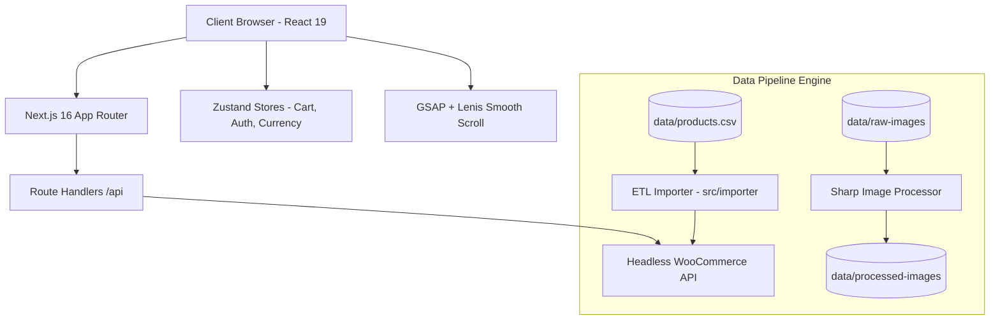

# House of Decor — Luxury E-Commerce & Decor Showcase

An aesthetic, high-performance luxury e-commerce and interior design frontend platform built with **Next.js 16 (App Router)**, **React 19**, **TypeScript**, **Tailwind CSS v4**, **GSAP**, and **Zustand**. Integrated with a Headless WooCommerce backend and powered by an automated ETL data import pipeline.

---

## 🏗️ System Architecture Overview

The system follows a modern decoupled frontend architecture designed for luxury visuals, reactive state management, and headless e-commerce integration.



For the complete in-depth architectural breakdown, sequence diagrams, and module responsibilities, read the [Architecture Documentation](docs/architecture.md).

---

## ✨ Key Features

- 🛋️ **Interactive Product Catalog**: Dynamic category filtering, material selectors, and multi-view product galleries.
- 📐 **Bespoke Product Customizer**: Real-time dimension calculator for rugs and luxury curtains with instant price scaling.
- 🛒 **Persistent Shopping Cart**: Zustand-driven cart with local storage persistence, variant management, and live drawer navigation.
- 💱 **Multi-Currency Engine**: Dynamic currency switching (USD, EUR, GBP, AED) with live price formatters.
- 🎨 **Luxury Animation System**: Integrated physics-based smooth scrolling (Lenis), magnetic cursor tracking, and GSAP scroll triggers.
- ⚙️ **Automated Product Ingestion ETL**: Custom TypeScript CLI pipeline (`src/importer/`) for parsing CSV product data, validating schema, generating payloads, and syncing parent products & variations to WooCommerce.
- 🖼️ **Image Optimization Pipeline**: Sharp-powered bulk converter (`src/scripts/process-images.ts`) transforming raw high-res images into lightweight WebP assets.

---

## 🛠️ Tech Stack

- **Framework**: Next.js 16.2.9 (App Router)
- **UI Library**: React 19.2.4
- **Language**: TypeScript 5.x / JavaScript ES2024
- **Styling**: Tailwind CSS v4, PostCSS, CSS Variables
- **Animations**: GSAP 3.15, Framer Motion 12, Lenis 1.3
- **State Management**: Zustand 5.0 (Persist Middleware)
- **Asset Processing**: Sharp 0.35
- **Icons & Toast**: Lucide React, React Hot Toast
- **Headless Backend**: WordPress + WooCommerce REST API

---

## 📁 Repository Structure

```
house-of-decor-frontend/
├── data/                       # Local data stores & image processing folders
│   ├── products.csv            # Raw CSV product export
│   ├── raw-images/             # Unprocessed high-res product images
│   └── processed-images/       # Sharp-optimized WebP images
├── docs/                       # Project Documentation
│   ├── architecture.md         # Detailed System Architecture Blueprint
│   └── performance-audit.md    # Production Performance Audit & Optimization Plan
├── public/                     # Public static assets & optimized icons
├── src/
│   ├── app/                    # Next.js 16 App Router (Pages & API Routes)
│   │   ├── api/                # Backend proxy route handlers
│   │   ├── products/           # Catalog & Product Detail Pages
│   │   ├── cart/               # Cart flow page
│   │   ├── bespoke/            # Custom order portal
│   │   └── layout.tsx          # Root app layout & smooth scroll provider
│   ├── components/             # Reusable UI component modules
│   │   ├── catalog/            # ProductGrid, ProductCard, ProductFilters
│   │   ├── product-presentation/ # CustomizerModal, Gallery, Specs
│   │   ├── layout/             # Header, Footer, MobileNav
│   │   └── hero/               # Interactive landing page sliders
│   ├── importer/               # Automated ETL Product Importer CLI Pipeline
│   │   ├── cli.ts              # Importer CLI entry point
│   │   ├── importer.ts         # 9-stage ETL pipeline orchestrator
│   │   ├── csv.parser.ts       # CSV reader
│   │   ├── mapper.ts           # WooCommerce payload transformer
│   │   ├── validator.ts        # Data schema validator
│   │   └── wc.service.ts       # WooCommerce REST API client
│   ├── lib/                    # Shared utilities, hooks & stores
│   │   ├── store/              # Zustand stores (useCartStore, useAuthStore, etc.)
│   │   └── utils/              # Helper utilities
│   ├── scripts/                # Build & asset automation scripts
│   │   ├── process-images.ts   # Sharp WebP image converter script
│   │   └── optimize-public.ts  # Public asset optimizer script
│   └── services/               # Data service abstraction (Product.js, Posts.js)
├── package.json
├── next.config.ts
└── README.md
```

---

## 🚀 Getting Started

### Prerequisites

- Node.js 18+ or Node.js 20+
- npm / pnpm / yarn

### Installation

1. Clone the repository:
   ```bash
   git clone https://github.com/your-org/house-of-decor-frontend.git
   cd house-of-decor-frontend
   ```

2. Install dependencies:
   ```bash
   npm install
   ```

3. Run the development server:
   ```bash
   npm run dev
   ```
   Open [http://localhost:3000](http://localhost:3000) in your browser.

---

## 📜 Available Scripts

| Script | Command | Purpose |
| :--- | :--- | :--- |
| **Development** | `npm run dev` | Starts local Next.js development server |
| **Production Build** | `npm run build` | Builds optimized Next.js production bundle |
| **Import Products** | `npm run import-products` | Executes ETL pipeline from `data/products.csv` |
| **Import Dry Run** | `npm run import-products:dry` | Validates CSV data without sending WooCommerce API requests |
| **Process Images** | `npm run process-images` | Converts high-res raw images to WebP format via Sharp |
| **Optimize Public** | `npm run optimize-public` | Compresses public assets |

---

## 📚 Documentation

- [System Architecture & Blueprint](docs/architecture.md)
- [Performance Audit & Optimization Analysis](docs/performance-audit.md)
