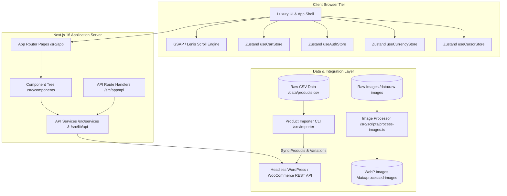
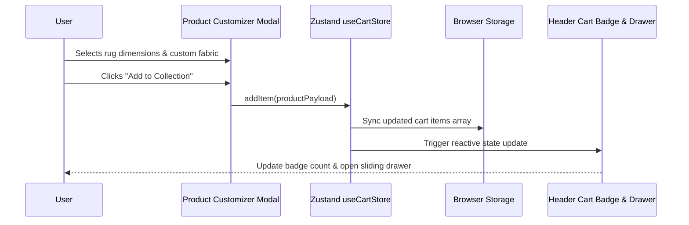

# House of Decor — System Architecture & Technical Blueprint

Welcome to the architectural documentation for **House of Decor** frontend application. This document details the software architecture, design patterns, component topology, data flows, state management, and asset pipelines powering the platform.

---

## 1. Executive Overview

**House of Decor** is a luxury e-commerce and interior design showcase application built on modern web technologies. The frontend delivers a rich, highly interactive user experience with smooth physics-based animations, customized luxury product configurators, multi-currency support, and persistent cart state, backed by a Headless WordPress/WooCommerce core and an automated ETL product ingestion pipeline.

### Core Stack Summary

| Layer | Technology / Library | Purpose |
| :--- | :--- | :--- |
| **Framework** | Next.js 16.2.9 (App Router, Turbopack) | Server-Side Rendering, SSG, Route Handlers |
| **UI Library** | React 19.2.4 | Declarative Component Architecture |
| **Language** | TypeScript 5.x / JavaScript ES2024 | Type Safety & Domain Modeling |
| **Styling** | Tailwind CSS v4 & Vanilla CSS | Modular styling & design token system |
| **Animations** | GSAP 3.15, Framer Motion 12, Lenis 1.3 | Micro-interactions, smooth scrolling, physics |
| **State Engine** | Zustand 5.0 (Persist Middleware) | Client state (Cart, Auth, Currency, Cursor) |
| **Asset Engine** | Sharp 0.35 | Image optimization & WebP pipeline |
| **Data Ingestion**| Custom TypeScript ETL (`src/importer/`) | Automated CSV & WooCommerce API integration |
| **Headless CMS** | WordPress + WooCommerce REST API | Catalog, Order processing, and Editorial content |

---

## 2. High-Level Architecture Diagram

The system operates across three primary tiers: **Client Browser Tier**, **Next.js Application Server Tier**, and **Headless Integration & Integration Pipeline Tier**.



---

## 3. Layered Architectural Breakdown

### 3.1 Presentation Layer (`src/app` & `src/components`)

The application utilizes Next.js App Router structure with clear separation between page-level views and re-usable presentation components.

```
src/
├── app/                        # App Router Pages & API Endpoints
│   ├── page.tsx                # Home Landing Page
│   ├── products/               # Product Catalog & Dynamic Filtering
│   │   ├── [category]/         # Category-specific Catalog
│   │   │   └── [id]/           # Product Detail Page (PDP)
│   │   └── page.tsx            # Main Catalog Page
│   ├── cart/                   # Interactive Cart Drawer / Page
│   ├── checkout/               # Checkout Flow Page
│   ├── bespoke/                # Bespoke / Custom Order Portal
│   ├── designer-trade-program/ # Trade Program Registration
│   ├── care-cleaning/          # Product Care & Fitting Guides
│   ├── account/                # User Profile & Order History
│   ├── login/                  # Auth Login View
│   ├── register/               # Auth Registration View
│   └── api/                    # Route Handlers (/api/products, /api/cart, etc.)
│
└── components/                 # Presentation Component Library
    ├── catalog/                # ProductGrid, ProductCard, FilterBar
    ├── product-presentation/   # CustomizerModal, Gallery, Specs
    ├── layout/                 # Header, Footer, MobileNav, SmoothScroll
    ├── bespoke/                # Bespoke showcase sections
    ├── hero/                   # Dynamic Hero banners & GSAP sliders
    ├── cart/                   # Cart Items, Summary, Shipping Estimator
    ├── craftsmanship/          # Brand story & craft animations
    └── philosophy/             # Brand values & interactive elements
```

### 3.2 State Management Layer (`src/lib/store`)

Client-side reactive state is governed by lightweight, decoupled Zustand stores with persistent storage bindings (`localStorage`):

1. **`useCartStore`**:
   - Manages cart items, custom product dimensions, color variations, quantities, drawer open/close state.
   - Calculates totals dynamically with client-side currency conversions.
   - Automatically synchronizes with `localStorage`.

2. **`useAuthStore`**:
   - Manages user session state, JWT tokens, authentication status, and customer profile details.

3. **`useCurrencyStore`**:
   - Manages active currency (e.g. USD, EUR, GBP, AED), exchange rates, and pricing formatter utilities.

4. **`useCursorStore`**:
   - Controls custom interactive cursor behavior (magnetic hover states, view text, drag indicators).



---

### 3.3 Headless Data & API Integration Layer (`src/services` & `src/lib/api`)

The frontend interfaces with the headless WordPress backend via structured API services and Next.js Route Handlers:

- **`src/services/Product.js`**: Fetches product listings, categories, variations, and ACF custom meta fields from WooCommerce REST endpoints (`/wp-json/wc/v3/products`).
- **`src/services/Posts.js`**: Fetches journal articles, editorial stories, and blog posts (`/wp-json/wp/v2/posts`).
- **`src/services/cartService.ts`**: Formats cart payloads, validates stock status, and prepares WooCommerce order submission objects.
- **Next.js Route Handlers (`src/app/api/`)**: Act as a server-side security proxy for WooCommerce credentials, handling operations such as `/api/validate-cart`, `/api/create-order`, `/api/auth`, and `/api/newsletter`.

---

### 3.4 Data Ingestion & ETL Import Pipeline (`src/importer`)

The project contains a standalone, robust 9-stage ETL (Extract, Transform, Load) product importer engine in TypeScript (`src/importer/`):

```mermaid
flowchart LR
    A[Raw CSV / JSON] --> B[1. CSV Parser]
    B --> C[2. Schema Validator]
    C --> D[3. Data Normalizer]
    D --> E[4. Payload Mapper]
    E --> F[5. Deduplication Lookup]
    F --> G[6. Parent Product Sync]
    G --> H[7. Variation Sync]
    H --> I[8. Taxonomy Tag Sync]
    I --> J[9. Execution Report]
```



- **Pipeline Modules**:
  - `cli.ts`: Command-line execution entry point (supports `--dry-run`).
  - `csv.parser.ts`: Streams and parses product data from CSV exports.
  - `validator.ts`: Validates product records against strict rules (required SKUs, pricing formats).
  - `mapper.ts`: Converts raw CSV rows to normalized WooCommerce API payloads (`WCProductPayload`, `WCVariationPayload`).
  - `wc.service.ts` & `variation.service.ts`: Communicates with WooCommerce API with rate limiting and retry handling.
  - `logger.ts` & `report.ts`: Provides styled CLI logging and generates detailed execution summaries.

---

### 3.5 Image Processing & Asset Optimization Engine (`src/scripts`)

To support high-resolution luxury visual assets without compromising performance, the project includes custom build-time asset scripts:

1. **`process-images.ts`**:
   - Converts raw high-res images (`.png`, `.jpg`, `.jpeg`, `.heic`) from `data/raw-images/` to optimized `.webp` format in `data/processed-images/`.
   - Constrains maximum width to 2000px using `sharp` to prevent server bloat while maintaining crisp quality on high-DPI displays.
2. **`optimize-public.ts`**:
   - Recursively inspects `public/` directory assets, reducing asset sizes and generating optimized formats for UI graphics.

---

## 4. Key E-Commerce & Application Data Flows

### Catalog Filtering & Product Customization Flow

1. User visits `/products` or `/products/[category]`.
2. Page requests dataset via `Product.js` service / API handler.
3. Client component applies facet filters (category, material, color, price range, room type) in real-time.
4. Clicking a configurable product opens `CustomizerModal`, allowing dynamic dimension calculation (square feet/meters price scaling) and custom edging options.
5. Cart submission dispatches to `useCartStore`, syncing item payload to `localStorage`.

---

## 5. Summary of System Scripts

| Command | Purpose |
| :--- | :--- |
| `npm run dev` | Launches Next.js local development server |
| `npm run build` | Builds optimized production bundle |
| `npm run import-products` | Runs product ingestion pipeline from `data/products.csv` |
| `npm run import-products:dry` | Performs dry-run validation of product importer without hitting API |
| `npm run process-images` | Bulk converts raw images in `data/raw-images` to optimized `.webp` |
| `npm run optimize-public` | Compresses public assets in `public/` directory |

---

## 6. Document References

- [Performance Audit Document](file:///c:/Users/Hp/Desktop/house-of-decor-frontend/docs/performance-audit.md)
- [Main Repository README](file:///c:/Users/Hp/Desktop/house-of-decor-frontend/README.md)
